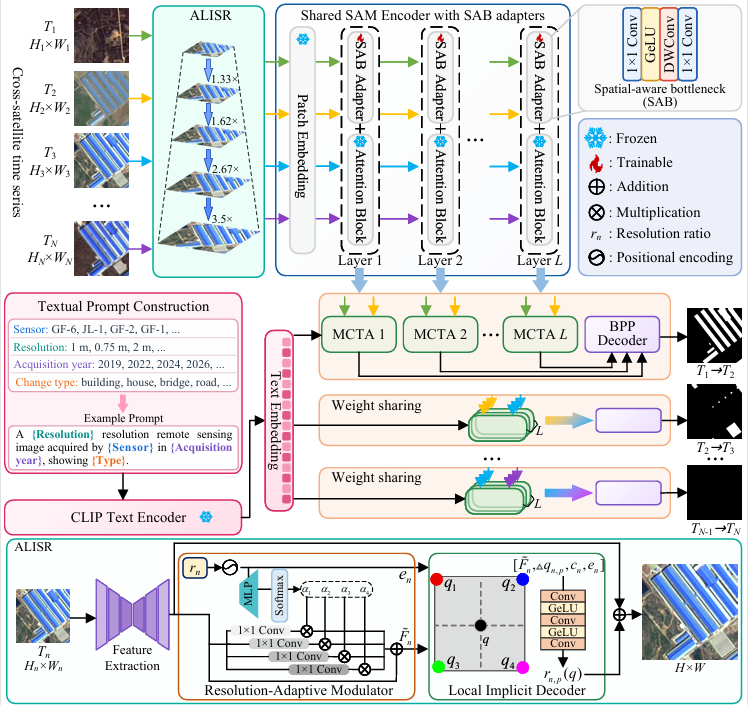
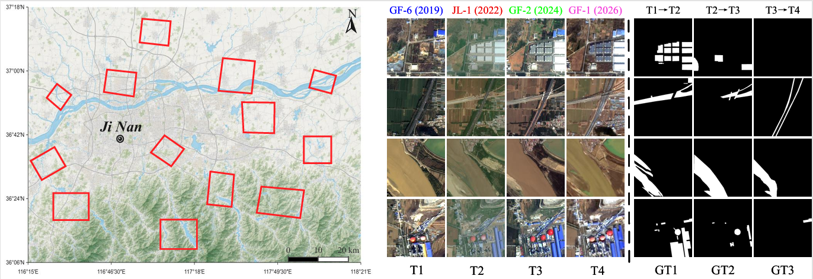

# MASS-Net

**Paper:** *Memory-Augmented SAM with Arbitrary-Scale Super-Resolution for Cross-Satellite Continuous Change Detection*  
**Authors:** Jian Xiao, Kai Zhang, Feng Zhang, Lei Ding, Mengying Xie, Jiande Sun

<p align="center">
  
</p>

> MASS-Net uses the **arbitrary resolution-adaptive local implicit super-resolution (ALISR)** module for spatial alignment and **memory-guided cross-temporal aggregation (MCTA)** with a **state update cell (SUC)** to mitigate cross-satellite spectral discrepancies and propagate change-aware features across time.
# CS-TSCD dataset

CS-TSCD is a remote sensing continuous change detection dataset composed of multi-temporal images acquired by different satellites, designed to study continuous change detection in cross-satellite settings.

<p align="center">
  
</p>

CS-TSCD is a remote sensing continuous change detection dataset composed of multi-temporal images acquired by different satellites, designed to study continuous change detection in cross-satellite settings.

### Dataset Description

- **Region:** 13 areas around Jinan, Shandong Province, China (urban expansion, buildings, water bodies, road networks, agricultural facilities, and bridges)
- **Satellites / Time:**
  - **Time 1:** GF-6, **2 m** resolution, acquired in **2019**
  - **Time 2:** JL-1, **0.75 m** resolution, acquired in **2022**
  - **Time 3:** GF-2, **1 m** resolution, acquired in **2024**
  - **Time 4:** GF-1, **2 m** resolution, acquired in **2026**
- **Upsampling ratios relative to JL-1:**
  - GF-6: **r = 2.67**
  - JL-1: **r = 1**
  - GF-2: **r = 1.33**
  - GF-1: **r = 2.67**
- **Bands used:** **RGB only** (R/G/B). *(The original multispectral images contain additional bands, while RGB bands are retained for compatibility with existing change detection networks.)*
- **Patch sizes:**
  - Time 1 (GF-6): **96×96**
  - Time 2 (JL-1): **256×256**
  - Time 3 (GF-2): **192×192**
  - Time 4 (GF-1): **96×96**
  - Change maps: **256×256**
- **Scale:** **3,389** four-temporal image sequences, each containing four RGB images and three binary change maps for **T1→T2**, **T2→T3**, and **T3→T4**, split into **train/val/test = 7:1:2**
- **Preprocessing:** radiometric calibration, atmospheric correction, orthorectification, geometric refinement, pansharpening (ENVI NNDiffuse), cross-temporal co-registration, patch cropping, and change labeling.

The dataset is avaliable at：https://pan.baidu.com/s/1kfJ6DDhKGRRwdr2AjvvDgg?pwd=2358


### Directory Structure 
```text
CD-TSCD/
  train/
    A/
    B/
    C/
    D/
    label/
    label2/
    label3/
 val/
    A/
    B/
    C/
    D/
    label/
    label2/
    label3/
  test/
    A/
    B/
    C/
    D/
    label/
    label2/
    label3/


